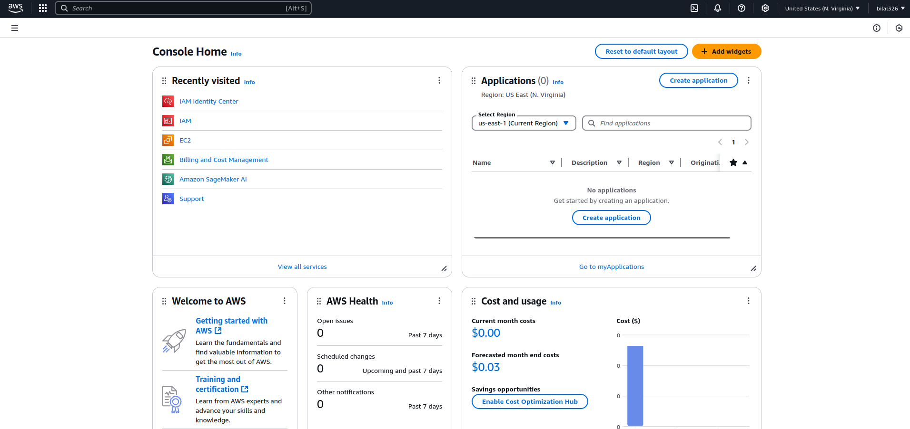
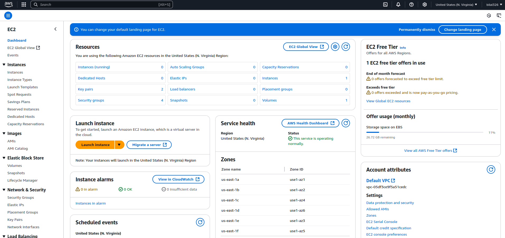
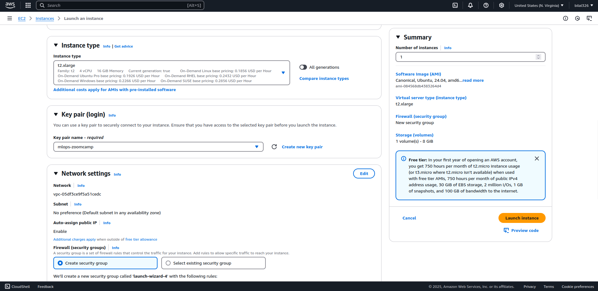
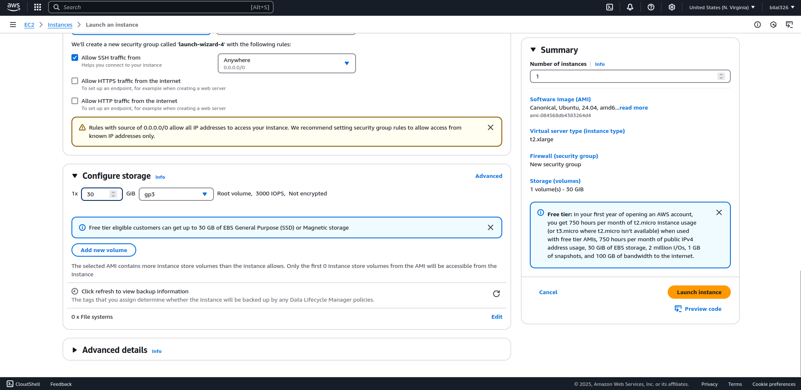
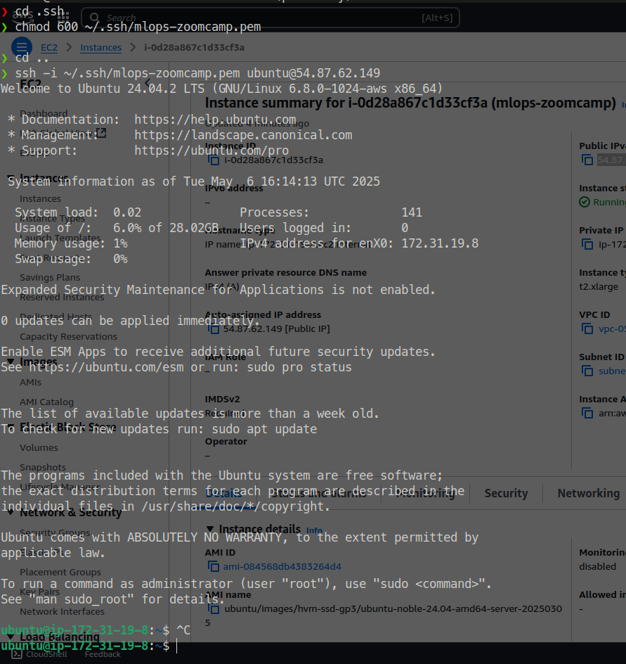
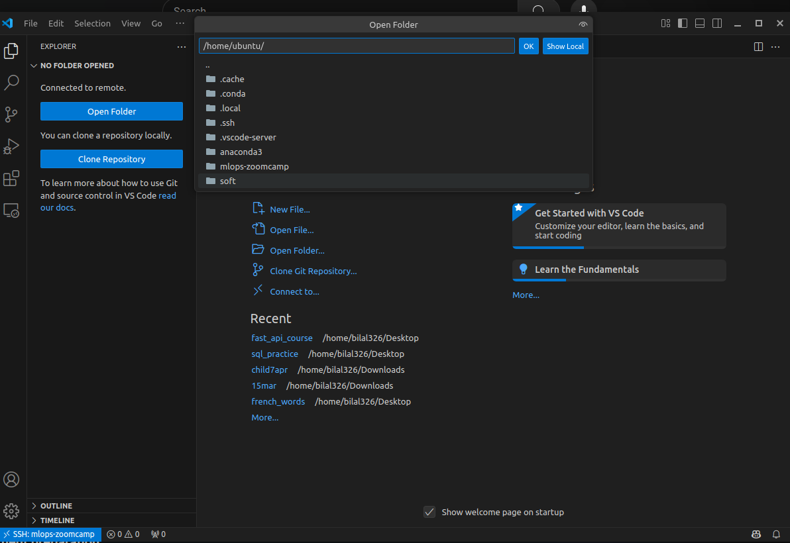
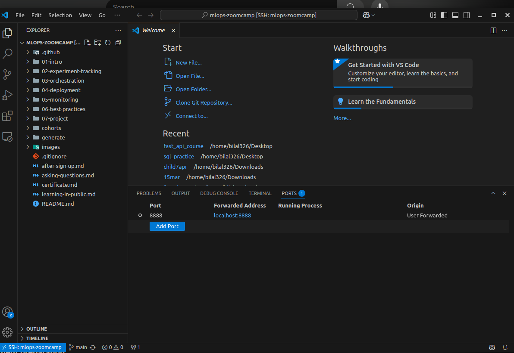

# Introduction

We will be predicting the duration of a ride (from picking him to dropping him off).

## Process for Machine Learning Projects

1. **Design:** Determine whether ML is the right tool for solving the problem  
2. **Train:** Train the model, Experiment Tracking  
3. **Deployment:** Deploy as an API

## AWS

[https://signin.aws.amazon.com](https://signin.aws.amazon.com)



### Creating an EC2 Instance



Launch instance  
`mlops-zoomcamp`  
Select OS as Ubuntu  
64-bit (x86) architecture

```bash
❯ cp /home/bilal326/Downloads/mlops-zoomcamp.pem .
❯ ls
mlops-zoomcamp.pem
```




```bash
❯ cd .ssh
❯ chmod 600 ~/.ssh/mlops-zoomcamp.pem
❯ cd ~
❯ ssh -i ~/.ssh/mlops-zoomcamp.pem ubuntu@54.87.62.149

```

Log out and configure SSH:
```bash
nano .ssh/config

Host mlops-zoomcamp
    HostName 54.87.62.149
    User ubuntu
    IdentityFile /home/bilal326/.ssh/mlop-zoomcamp.pem
    StrictHostKeyChecking no

```

Then connect:

```bash
ssh mlops-zoomcamp

```
Note: You'll have to change the public IP whenever you turn off the EC2 instance.
```bash
which python3
sudo apt update
sudo apt install python3-pip

```

Download and install Anaconda:
```bash
wget https://repo.anaconda.com/archive/Anaconda3-2024.10-1-Linux-x86_64.sh
bash Anaconda3-2024.10-1-Linux-x86_64.sh 

```
When prompted:

```bash
You can undo this by running `conda init --reverse $SHELL`? [yes|no]
[no] >>> yes

```

Install Docker:

```bash
sudo apt install docker.io

```

Install Docker Compose:
```bash
wget https://github.com/docker/compose/releases/download/v2.35.1/docker-compose-linux-x86_64 -O docker-compose
nano .bashrc
```

Add to .bashrc:
```bash
export PATH="${HOME}/soft:${PATH}"
```
Then run:
```bash
source .bashrc
which docker-compose
sudo usermod -aG docker $USER

```
Clone the repo:
```bash
git clone https://github.com/DataTalksClub/mlops-zoomcamp.git
cd mlops-zoomcamp
```
Connect to the host:
EC2 Dashboard





# Training a Ride duration prediction model

[Data Page](https://www.nyc.gov/site/tlc/about/tlc-trip-record-data.page)

Green Taxi Trip Records
```bash
wget https://d37ci6vzurychx.cloudfront.net/trip-data/green_tripdata_2021-01.parquet

wget https://d37ci6vzurychx.cloudfront.net/trip-data/green_tripdata_2021-02.parquet
```

Worked on [the Jupyter Notebook](/home/bilal326/Desktop/mlops_zoomcamp_25/01_week1/prediction.ipynb) here
