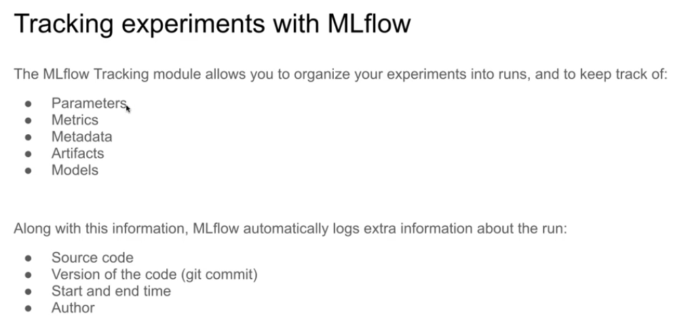
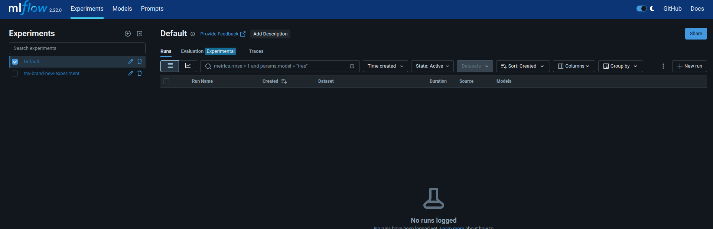

# ML Experiment Tracking
## Introduction
Process of keeping track of all the relevant information from an ML experiment. These include:
1. Source Code
2. Environment
3. Data
4. Model
5. Hyperparameters
6. Metrics
...

Key terms:
- `Experiment run:` each trial
- `Run artifact:` any file associated with a trial

Reasons for experiment tracking:
1. Reproducability
2. Organization
3. Optimization

Spreadsheets dont have No Visibility and Collaboration + No Standard Format + Error Prone.




## Installation

requirements.txt
```bash
mlflow
jupyter
scikit-learn
pandas
seaborn
hyperopt
xgboost
```

```bash
source venv/bin/activate
pip install -r requirements.txt

mlflow
mlflow ui

# ask mlflow to store all artifacts and metadata in sqlite
# run in terminal
mlflow ui --backend-store-uri sqlite:///mlflow.db

# jupyter
import mlflow
mlflow.set_tracking_uri("sqlite:///mlflow.db")
mlflow.set_experiment("my-brand-new-experiment")
```

